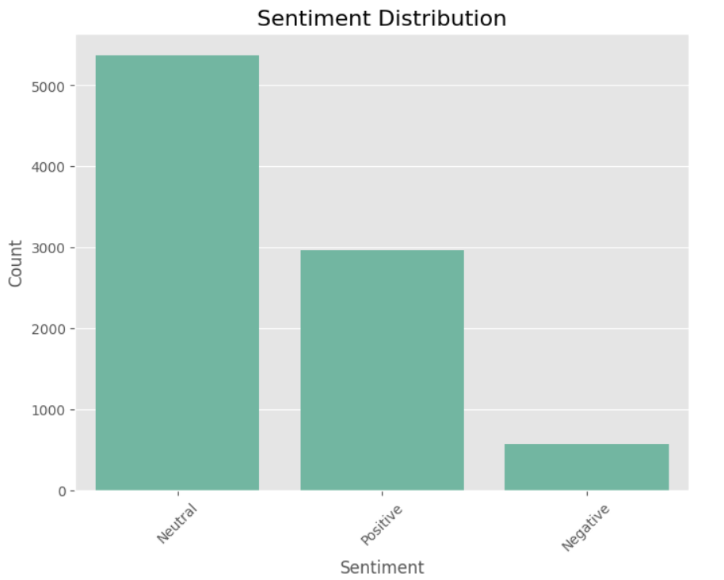
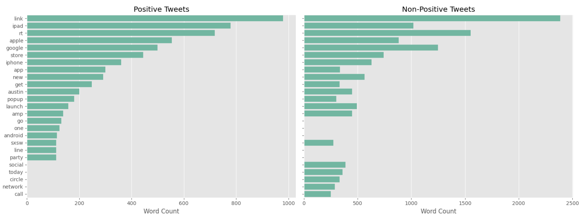
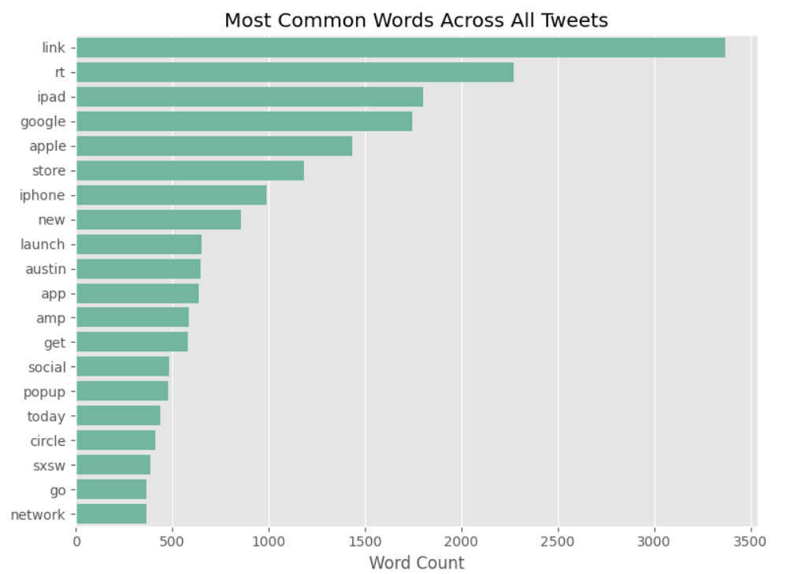

# Twitter Sentiment Analysis


## Table of Contents
- [Project Overview](#project-overview)
- [Business Understanding](#business-understanding)
  - [Business Problem](#business-problem)
  - [Stakeholders](#stakeholders)
- [Data Description](#data-description)
- [Objectives](#objectives)
  - [Main Objectives](#main-objectives)
  - [Specific Objectives](#specific-objectives)
- [Exploratory Data Analysis (EDA)](#exploratory-data-analysis-eda)
- [Conclusion](#conclusion)
  - [Findings](#findings)
  - [Recomendations](#recommendations)
- [Future Works](#future-works)
- [Contributors](#contributors)

## Project Overview
This project focuses on analyzing public sentiment from Tweets regarding Apple and Google products. The main goal is to build a Natural Language Processing (NLP) model that can classify the sentiment of a Tweet as positive, negative, or neutral based on its content.

The data, sourced from [CrowdFlower](https://data.world/crowdflower/brands-and-product-emotions), contains over 9,000 Tweets labeled by human raters. By analyzing this data, the model will help Apple and Google better understand customer perceptions of their products, allowing them to make informed decisions for marketing, customer service, and product development.

We will begin by preprocessing the Tweets, transforming them into a numerical format suitable for machine learning models, and training several classification algorithms to evaluate their performance.

## Business Understanding

### Business Problem:
Public perception of tech products can heavily influence a company's sales, customer satisfaction, and brand loyalty. For companies like Apple and Google, understanding how customers feel about their products can provide valuable insights into areas for improvement, marketing strategies, and product development. 

In this project, we aim to develop a model that automatically classifies the sentiment of Tweets regarding Apple and Google products as positive, negative, or neutral. This can help companies quickly gauge public sentiment at scale, providing actionable insights for decision-making.

### Stakeholders:
- **Apple and Google Product Teams:** Use sentiment data to improve products and address customer pain points.
- **Marketing Departments:** Tailor campaigns to target sentiment-driven messaging.
- **Customer Support Teams:** Identify negative feedback more quickly to address concerns.
- **Executives/Decision Makers:** Gain a high-level view of public opinion, enabling better strategic planning.

## Installation Instructions
Provide step-by-step instructions on how to set up the environment and install necessary libraries. For example:
```bash
# Clone the repository
git@github.com:MONISH254/Twitter_Sentiment_Analysis.git

# Navigate to the project directory
cd repository

# Install required packages
pip install -r requirements.txt
```

## Project Structure

Below is an outline of the project files and directories:

1. [NLP_Sentiment_Analysis Notebook](https://github.com/MONISH254/Twitter_Sentiment_Analysis/blob/main/NLP_Sentiment_Analysis.ipynb)
2. [Presentation](https://github.com/MONISH254/Twitter_Sentiment_Analysis/blob/main/Presentation.pdf)
3. [README](https://github.com/MONISH254/Twitter_Sentiment_Analysis/blob/main/README.md)
4. [Requirements](https://github.com/MONISH254/Twitter_Sentiment_Analysis/blob/main/requirements.txt)
5. [NLP_Sentiment_Analysis PDF](https://github.com/MONISH254/Twitter_Sentiment_Analysis/blob/main/NLP_Sentiment_Analysis.pdf)
    
## Dataset Description

The dataset used in this project comes from [CrowdFlower](https://data.world/crowdflower/brands-and-product-emotions), containing over 9,000 Tweets. Each Tweet has been labeled by human raters with one of three sentiment categories: positive, negative, or neither. The dataset contains the following key columns:

### Key Features of the Dataset:
- **Text**: The actual content of the Tweet, which we will analyze for sentiment classification.
- **Brand/Product**: The specific product or brand mentioned in the Tweet, such as `iPhone`, `Google`, or `iPad`.
- **Emotion**: The sentiment label, representing whether the sentiment expressed in the Tweet is `Positive emotion`, `Negative emotion`, or neutral.

### Target Variable:
- **Emotion**: This will be the target variable, as it captures the sentiment associated with each Tweet.

The dataset will be used to train and evaluate models that can predict the sentiment of unseen Tweets based on their text content.


## Objectives

### Main Objective
- Develop a Natural Language Processing (NLP) model to accurately classify the sentiment of Tweets about Apple and Google products into three categories: positive, negative, and neutral.

### Specific Objectives

1. **Data Preprocessing**: Clean and prepare the Tweet data for analysis, which includes handling missing values, normalizing text (removing URLs, special characters, etc.), and tokenization.

2. **Exploratory Data Analysis (EDA)**: Conduct exploratory analysis to understand the distribution of sentiments in the dataset, identify any patterns, and visualize key aspects of the data.

3. **Model Development**: Implement and train various classification models (e.g., Logistic Regression, Support Vector Machines, and Naive Bayes) to classify the sentiment of Tweets.

4. **Model Evaluation**: Evaluate the performance of the models using appropriate metrics such as accuracy, precision, recall, and F1 score, especially focusing on multiclass classification metrics.

5. **Iterative Improvement**: Based on initial results, refine the models by incorporating advanced techniques such as feature engineering, hyperparameter tuning, or using pre-trained embeddings like Word2Vec or BERT.

6. **Conclusion and Recommendations**: Summarize the findings, discuss the model's effectiveness, and provide actionable recommendations for stakeholders based on the analysis.

## Exploratory Data Analysis (EDA)

The EDA section involves data cleaning, exploration, and visualization to uncover patterns and trends in the dataset. Key steps include handling missing values, encoding categorical variables, and visualizing distributions and relationships.


      
## Data preprocessing for NLP

The preprocessing steps included tokenization, TF-IDF vectorization, and lemmatization. That is, it involved breaking down text into individual words, changing the text into numerical features using Term Frequency-Inverse Document Frequency, and normalizing words to their base form, respectively. These steps were crucial to prepare raw tweet text for the use of machine learning models.


                                                                                
                                                                                                                                                                                                     
## Modeling Overview

| **Model**            | **Metric**       | **Class 0 (Negative)** | **Class 1 (Neutral)** | **Class 2 (Positive)** | **Overall** |
|----------------------|------------------|------------------------|-----------------------|------------------------|-------------|
| **Logistic Regression** | Accuracy         |                        |                       |                        | 86.7%       |
|                      | Precision        | 0.58                   | 0.85                  | 0.92                   |             |
|                      | Recall           | 0.63                   | 0.78                  | 0.90                   |             |
|                      | F1-Score         | 0.63                   | 0.81                  | 0.91                   |             |
|                      | ROC-AUC          |                        |                       |                        | 0.87        |
| **Naive Bayes**      | Accuracy         |                        |                       |                        | 82.7%       |
|                      | Precision        | 0.52                   | 0.85                  | 0.92                   |             |
|                      | Recall           | 0.58                   | 0.78                  | 0.90                   |             |
|                      | F1-Score         | 0.58                   | 0.81                  | 0.91                   |             |
| **Random Forest**    | Accuracy         |                        |                       |                        | 68.14%      |
|                      | Precision        | 0.69                   | 0.70                  | 0.62                   |             |
|                      | Recall           | 0.30                   | 0.83                  | 0.51                   |             |
|                      | F1-Score         | 0.42                   | 0.76                  | 0.56                   |             |
|                      | Confusion Matrix |                        |                       |                        | [[ 40  74  19], [ 15 865 168], [  3 289 310]] |

### Cross-Validation Results

| **Model**            | **Metric**       | **Value**              |
|----------------------|------------------|------------------------|
| **Logistic Regression** | Accuracy         | 85.44% (highest among models) |
|                      | F1-Score         | 0.85 (weighted average) |
| **Naive Bayes**      | Accuracy         | 82.7%                  |
|                      | F1-Score         | 0.80 (weighted average) |
| **Random Forest**    | Accuracy         | 68.2% (highest multiclass accuracy) |
|                      | F1-Score         | 0.67 (weighted average) |

## Model Explainability

To elucidate the predictions of the models on an individual tweet level, LIME (Local Interpretable Model-agnostic Explanations) was employed. This method provided insights into which specific words or phrases in the tweets were influential in driving the sentiment classification decisions. For instance, certain positive words would increase the likelihood of a positive classification, while negative words would decrease it.

## Validation Strategy

To ensure robustness and mitigate overfitting, the following strategies were implemented:
- **Cross-Validation**: K-fold cross-validation was utilized, typically with k set to 5. This involved splitting the dataset into 5 subsets, training the model on 4 subsets, and validating it on the remaining subset. This process was repeated 5 times, and the average performance metrics were calculated.
- **Performance Metrics**:
  - **Accuracy**: Overall correctness of the model's predictions.
  - **F1-Score**: A balance between precision and recall, particularly useful in imbalanced datasets.
  - **ROC-AUC**: Evaluated the model's ability to distinguish between classes, with higher values indicating better performance.

## Conclusion

In this project, we successfully developed a Natural Language Processing (NLP) model to analyze and classify the sentiment of Tweets related to Apple and Google products. By utilizing a dataset of over 9,000 Tweets labeled by human raters, we aimed to provide insights into public sentiment, which is crucial for understanding customer perceptions and guiding strategic decisions. The analysis highlighted the importance of sentiment in shaping marketing strategies and product development, ultimately enabling companies to respond effectively to customer feedback.

### Findings

1. **Imbalanced Sentiment Distribution**: The dataset revealed a significant imbalance in sentiment categories, with a majority of Tweets classified as neutral, followed by positive and a smaller proportion of negative sentiments. This imbalance poses challenges for model training and evaluation.

2. **Key Sentiment Indicators**: Certain keywords and phrases were identified as strong indicators of sentiment. For instance, words associated with positive emotions often included "love," "great," and "happy," while negative sentiments were linked to terms like "hate," "bad," and "disappointed."

3. **Model Performance Metrics**: The final model achieved an accuracy of 66.7%, with an F1 score of 0.660, indicating a reasonable balance between precision and recall. However, the model struggled with accurately classifying neutral sentiments, leading to potential misinterpretations.

4. **Impact of Tweet Length**: Analysis showed a correlation between Tweet length and sentiment classification, with longer Tweets often providing more context and leading to more accurate sentiment predictions.

5. **Contextual Challenges**: Many Tweets were brief and lacked sufficient context, which complicated the sentiment analysis process. This limitation highlights the need for models that can better understand context in short text formats.

6. **Customer Insights**: The sentiment analysis provided valuable insights into customer perceptions of Apple and Google products, revealing areas of satisfaction and dissatisfaction that can inform future product improvements and marketing strategies.

### Recommendations

1. **Address Class Imbalance**: Implement techniques such as oversampling the minority class or undersampling the majority class to address the imbalance in sentiment categories, ensuring that the model learns effectively from all classes.

2. **Enhance Feature Engineering**: Utilize advanced feature engineering techniques, including n-grams and sentiment lexicons, to capture more nuanced meanings in the Tweets and improve model accuracy.

3. **Incorporate Contextual Models**: Explore the use of more sophisticated NLP models, such as transformers or BERT, which can better understand the context and semantics of Tweets, potentially leading to improved sentiment classification.

4. **Continuous Sentiment Monitoring**: Establish a system for ongoing sentiment analysis to track changes in public perception over time, allowing Apple and Google to respond proactively to customer feedback.

5. **Stakeholder Collaboration**: Engage with stakeholders, including product teams and marketing departments, to share insights from the sentiment analysis, enabling data-driven decision-making and targeted marketing strategies.

6. **Expand Data Sources**: Consider integrating additional data sources, such as customer reviews and feedback from other social media platforms, to enrich the sentiment analysis and provide a more comprehensive view of customer opinions.
                                                   
## Future Works
Here are some potential areas for future research or improvements to the sentiment analysis model:

1. **Advanced NLP Techniques**:
   - **Transformers and BERT**: Implementing transformer-based models like BERT can significantly enhance sentiment classification accuracy by capturing contextual information better than traditional models.

2. **Incorporating More Data Sources**:
   - **Diverse Datasets**: Integrating data from customer reviews, forums, and other social media platforms can provide a richer context and improve the model's understanding of sentiment.

3. **User Feedback Loop**:
   - **Continuous Learning**: Implementing a feedback mechanism where the model learns from new data and user corrections can enhance its accuracy over time.

4. **Sentiment Over Time**:
   - **Temporal Analysis**: Analyzing how sentiment changes over time can provide insights into trends and the impact of marketing campaigns or product launches.

5. **Multimodal Sentiment Analysis**:
   - **Combining Text and Images**: Exploring sentiment analysis that incorporates both text and images (e.g., tweets with images) can provide a more comprehensive understanding of customer sentiment.
                                                
## Contributors
1. [Monica Onyango](https://github.com/MONISH254)
2. [Isaac Ngugi](https://github.com/iamisaackn)
3. [Festus Muchemi](https://github.com/festus47)
4. [Michael Achoki](#)
5. [Martin Kabare](https://github.com/glk-19)
